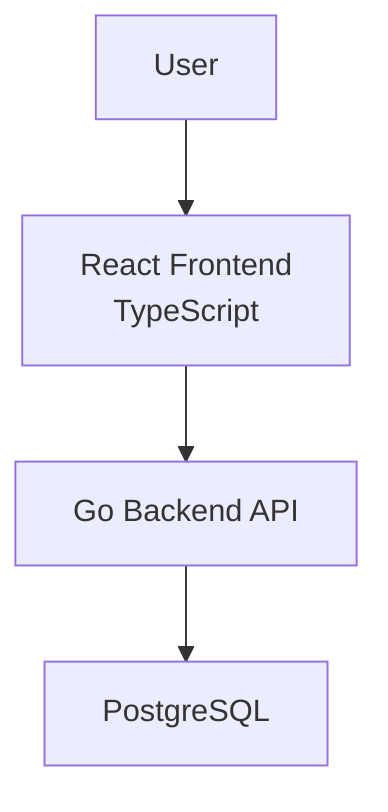

# Architecture

ApplyBy is a full-stack personal job application CRM.

This document focuses on system boundaries, runtime structure, data flow, and tradeoffs. Product framing and current feature status live in `README.md`.

---

## 1. Introduction and Goals

### 1.1 Purpose

ApplyBy helps a single user track and manage their job-search pipeline. The current user-facing feature list lives in `README.md`; this document describes how those workflows are structured.

### 1.2 Quality Goals

| Goal | Description |
| --- | --- |
| Clear boundaries | Domain, application, storage, API, frontend, search, and reminders responsibilities should stay separate. |
| Low coupling | Backend layers should depend on stable domain and application contracts rather than concrete infrastructure details. |
| Testability | Domain and application behavior should be testable without running the full frontend or database. |
| Practical scope | The project should show thoughtful full-stack design without becoming a production SaaS platform in its first version. |
| Portfolio value | The project should demonstrate full-stack engineering practice: data modeling, workflow validation, and layered tests. See Section 3 for the stack. |

### 1.3 Stakeholders

| Stakeholder | Interest |
| --- | --- |
| Author/Admin | Build a disciplined full-stack portfolio project and practice good engineering habits. |
| Job seeking user | Track applications, deadlines, follow-ups, contacts, interview status, and outcomes. |
| Reviewer or employer | Understand the architecture, design tradeoffs, implementation scope, and testing approach. |

---

## 2. Constraints

### 2.1 Technical Constraints

ApplyBy uses the implementation direction recorded in the accepted ADRs.

### 2.2 Scope Constraints

The first version is scoped for a single-user job-search workflow.

### 2.3 Process Constraints

Keep changes focused and reviewable.

---

## 3. Solution Strategy

ApplyBy is built as a full-stack application with:

- a Go backend
- a PostgreSQL database
- a React + TypeScript frontend
- layered tests

The backend is implemented in layers: `domain`, `application`, `storage`, `api`, `search`, `reminders`, and `config`. See Section 6.1 for each layer's responsibility and what it should not own.

Business rules should live in backend domain and application code.

Business rules should not be hidden in:

- HTTP handlers
- database repositories
- frontend components
- SQL query details

---

## 4. System Context and Containers

ApplyBy is intended for one user managing their own job-search pipeline. It is organized around three runtime containers; tests are not a runtime container, they are colocated with the source areas they verify.



### 4.1 External Actors

| Actor | Description |
| --- | --- |
| User | The person managing their job-search pipeline. |
| Browser | Runs the React frontend. |
| PostgreSQL | Stores job-search records and supports query paths. |

### 4.2 Containers

| Container | Technology | Responsibility |
| --- | --- | --- |
| React Frontend | React, TypeScript | User-facing screens, forms, display state, and API calls. |
| Go Backend API | Go | Domain behavior, application workflows, HTTP API boundaries, and coordination between layers. |
| PostgreSQL | PostgreSQL | Durable relational storage for job-search data. |

Testing remains layered, but the test code is not represented as a separate container. Go tests live beside the packages they verify, PostgreSQL repository tests live with the PostgreSQL adapter, and frontend tests live under `web/src`.

### 4.3 Important Boundary Rules

| Rule | Reason |
| --- | --- |
| Frontend components should not own lifecycle rules. | Backend domain/application code should enforce workflow correctness. |
| HTTP handlers should not contain business rules. | Handlers should translate transport concerns into application use cases. |
| Repositories should not own workflow rules. | Storage should persist and query data, not decide valid business behavior. |
| Domain code should not depend on infrastructure. | Domain rules should remain simple, portable, and testable. |

## 5. Deferred External Systems

| System | Reason Deferred |
| --- | --- |
| Email provider | Inbox sync would increase scope and require authorization concerns. |
| Calendar provider | Calendar sync is useful but not required for the first version. |
| Job boards | Scraping or importing job posts would expand the project beyond the core tracker. |
| AI services | Resume rewriting or matching is future work, not part of the first version. |

---

## 6. Building Block View

### Current CRUD Scope

Future maintenance work should continue to follow the existing layered design: domain validation, application service orchestration, repository persistence, thin API handlers, frontend API boundaries, and activity recording where appropriate.

The current backend package layout is:

```text
cmd/
  applyby-api/
    main.go
    wiring.go

internal/
  analytics/
  api/
  application/
  config/
  domain/
  reminders/
  search/
  storage/
    postgres/
```

`internal/analytics` is currently a placeholder package (no implemented behavior yet), reserved for the deferred analytics work described in `README.md`.

Backend tests are colocated with the packages they verify as `*_test.go` files. PostgreSQL repository tests live under `internal/storage/postgres`.
### 6.1 Backend Building Blocks

| Building Block | Responsibility | Should Not Own |
| --- | --- | --- |
| `domain` | Entities, value objects, status values, lifecycle rules, domain validation, domain errors. | Database access, HTTP behavior, frontend behavior. |
| `application` | Use cases such as creating applications, updating statuses, scheduling follow-ups, and recording activity. | SQL details, HTTP response formatting, UI state. |
| `storage` | PostgreSQL schema, migrations, repositories, database-backed queries, integration tests. | Core workflow decisions. |
| `api` | Routes, request parsing, response formatting, error mapping, handler tests. | Business rules. |
| `search` | Search criteria, filter criteria, sort criteria, search-related validation. | UI rendering. |
| `reminders` | Due reminder selection, priority behavior, follow-up scheduling behavior. | API routing or frontend display. |
| `config` | Configuration loading and validation. | Domain behavior. |
| `analytics` | Placeholder for job-search summary/reporting behavior. Not yet implemented. | Frontend rendering, persistence-specific implementation details. |

### 6.2 Frontend Building Blocks

See `docs/FRONTEND_UX.md`'s "Frontend Architecture Rules" for how the frontend is organized (route-level pages, components, shared types, API client boundary).

---

## 7. Runtime Views

### 7.1 Create Application

```text
User
  -> React form
  -> Backend API request
  -> Application use case
  -> Domain validation
  -> PostgreSQL repository
  -> API response
  -> Frontend updates view
```

The create workflow should validate required fields and create an initial application record.

### 7.2 Update Application Status

```text
User
  -> Status update control
  -> Backend API request
  -> Application use case
  -> Domain status transition validation
  -> Activity event recorded
  -> Application status persisted
  -> API response
```

Status transitions should be validated by backend domain/application logic.

### 7.3 Schedule Follow-Up

```text
User
  -> Follow-up input
  -> Backend API request
  -> Application use case
  -> Reminder validation
  -> Reminder persisted
  -> API response
```

Follow-up logic should support reminder queries and future prioritization.

### 7.4 Search and Filter Applications

```text
User
  -> Search/filter controls
  -> Backend API request
  -> Query criteria validation
  -> Repository query
  -> API response
  -> Frontend list updates
```

Search and filtering should rely on intentional query paths rather than ad hoc frontend-only filtering for all behavior.

---

## 8. Data Design

ApplyBy data is naturally relational.

### 8.1 Current Records

| Record | Description |
| --- | --- |
| Application | A tracked job opportunity or submitted job application. |
| Company | An organization associated with one or more applications. |
| Contact | A person associated with a company, application, referral, or recruiter interaction. |
| Reminder | A follow-up or deadline item. |
| Document | Metadata for a resume, cover letter, portfolio item, or related file. |
| Activity Event | A historical event describing something that happened in the system. |
| Status History | A record of application status changes over time. |

### 8.2 Conceptual Model

```text
Company
  -> many Applications
  -> many Contacts

Application
  -> belongs to Company
  -> has a lifecycle status
  -> many Reminders
  -> many Documents
  -> many Activity Events
  -> many Status History entries
```

### 8.3 Deferred Records

Dedicated interview records and expanded job-search analytics are deferred.


### 8.4 PostgreSQL Responsibilities

PostgreSQL should support:

- relational integrity
- unique constraints where appropriate
- foreign keys
- indexed search and filtering
- due reminder queries
- dashboard summary and filtering queries

The first persistence implementation should avoid overcomplicated schema design. The schema should support the first application workflows while leaving room for later features.

---

## 9. Cross-Cutting Concepts

### 9.1 Domain Rules

Application lifecycle rules are centralized in backend domain/application layers. See Section 4.3 for the frontend/backend boundary rule this implies.

### 9.2 Activity History

Important user actions should be represented as activity events.

### 9.3 Search and Filtering

Search and filtering are core product behaviors, not incidental UI features.

The backend and database should provide clear query paths for common application views.

### 9.4 Reminder Priority

Reminders and follow-ups are central to the product.

Priority behavior should be explicit and testable rather than hidden in UI sorting logic.

### 9.5 Testing

Tests should verify behavior, not implementation details.

ApplyBy keeps tests colocated with the source areas they verify.
### 9.6 Documentation

Documentation should stay aligned with implementation state. See `README.md` for the full documentation map.

---

## 10. Architecture Decisions and Tradeoffs

### 10.1 Decision References

Accepted ADRs are indexed in `docs/adr/README.md`.

The primary architectural tradeoff is deliberate structure over minimal file count.

---

## 11. Risks and Technical Debt

| Risk | Description | Mitigation |
| --- | --- | --- |
| Boundary drift | Business rules may drift into handlers, repositories, or frontend components. | Keep domain and application tests focused on lifecycle rules and workflows. |
| Database test setup | Integration tests require a reliable PostgreSQL test setup. | Keep database setup instructions current in runnable documentation. |
| Contract drift | Frontend types and backend responses can diverge. | Keep response shapes simple and document contracts as they stabilize. |

---

## 12. Glossary

Core record definitions (Application, Company, Contact, Reminder, Document, Activity Event, Status History) are in Section 8.1. Terms not covered there:

| Term | Definition |
| --- | --- |
| Interview status | An application lifecycle status indicating that an application is in an interview stage. |
| Status Transition | A change from one application lifecycle status to another. |
| Repository | A storage abstraction used by application code to persist and retrieve data. |
| Use Case | An application workflow such as creating an application, updating status, or scheduling a follow-up. |