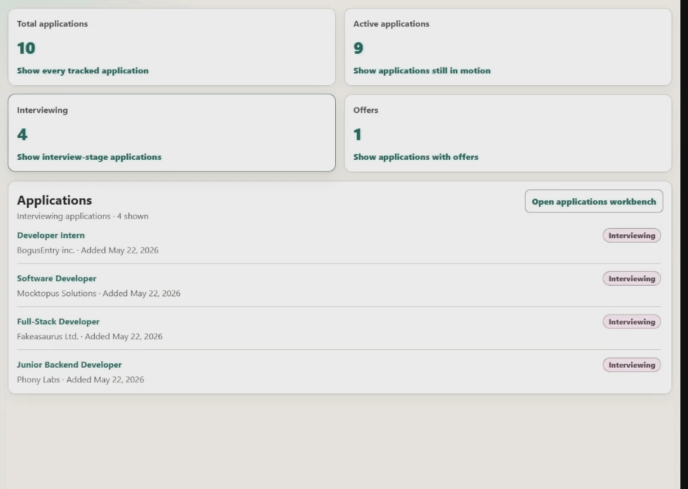
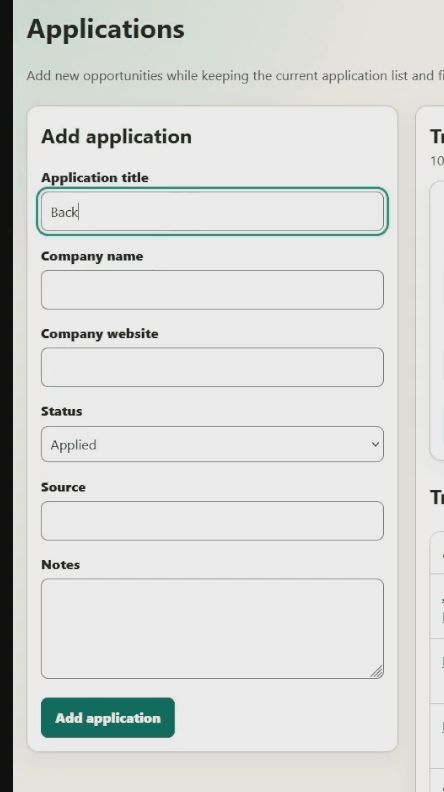
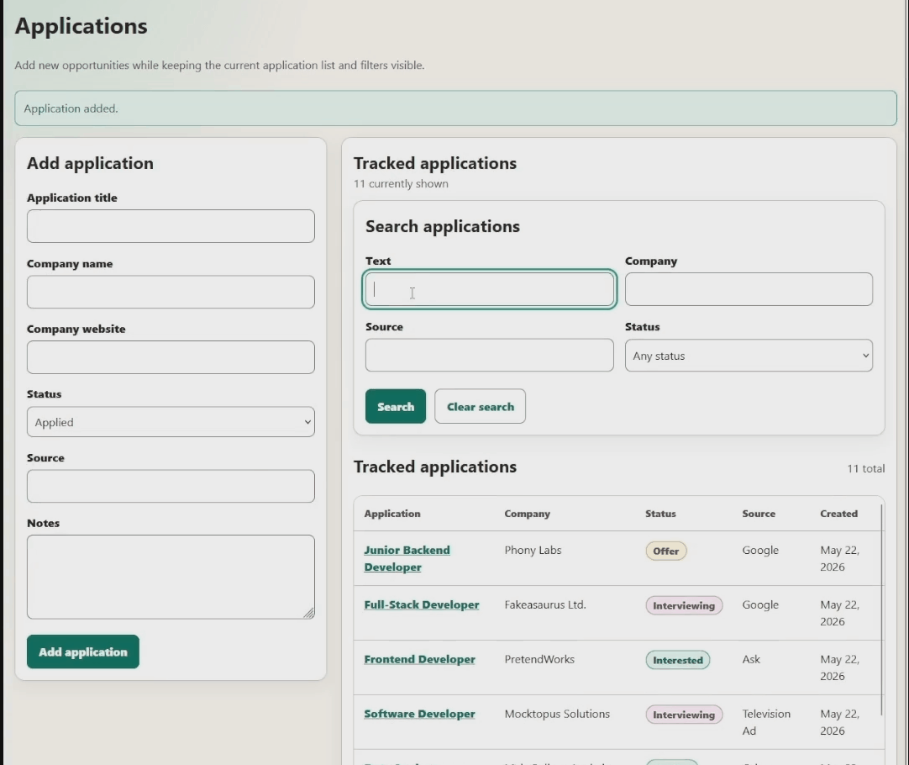
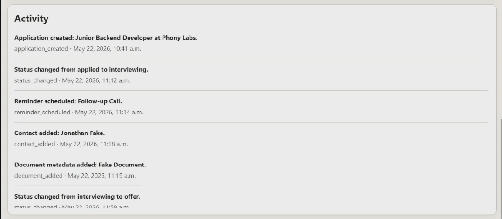

# ApplyByterviews, follow-ups, documents, and outcomes.

ApplyBy is a personal job application CRM for tracking applications, deadlines, companies, contacts, interview status, follow-ups, document metadata, activity history, and outcomes.

The project is intended to be a practical job-search tool and a portfolio project focused on disciplined application design. It emphasizes clear domain modeling, validated workflows, performance-conscious data structures, searchable records, reminder prioritization, activity history, and dashboard summary filtering.

# ApplyBy

ApplyBy is a personal job application CRM for tracking applications, deadlines, companies, contacts, interviews, follow-ups, documents, and outcomes.

## At a Glance

- Type: Local-first full-stack job application CRM
- Backend: Go
- Frontend: React + TypeScript
- Database: PostgreSQL
- Demonstrates: CRUD workflows, relational persistence, search/filtering, reminders, contacts, document metadata, activity history, and layered testing
- Status: First prototype

## Demo

ApplyBy is demonstrated with fictional demo data. 

- [Watch the demo video](https://youtu.be/ObvVGlxBuSs)
- See [QUICKSTART.md](./QUICKSTART.md) for local setup

### Dashboard filtering

You can filter applications directly from the dashboard using prebuilt summary buttons for quick triage.

### Create application

The applications workbench provides the main management view, where new job applications can be added to ApplyBy.

### Workbench filtering

The applications workbench supports more granular filtering for narrowing records by application details and workflow state.

### Application activity tracking

Each application has its own workflow area for status updates, reminders, contacts, and document metadata. Document metadata can include URI-style references to application-related materials.

Changes are tracked through a per-application activity feed, creating a lightweight history of important workflow events.

## Project Goals

ApplyBy is designed to help an individual answer questions such as:

- Which jobs have I applied to?
- Which applications have upcoming deadlines?
- Which applications need follow-up?
- Which companies and contacts am I interacting with?
- Which interview stages are active?
- Which resume or document version did I use?
- Which sources and application strategies are producing responses?

## Current Product Features

- Application tracking
- Application detail editing
- Application status tracking
- Company and source tracking
- Contact management
- Follow-up reminders
- Reminder completion
- Document metadata tracking
- Activity timeline
- Search and filtering
- Dashboard summary filtering
- Direct navigation from dashboard to application details
## Current Engineering Features

- Explicit domain model for applications, companies, contacts, reminders, document metadata, activity events, status history, and status values
- Application services for create, read, update, remove, search, status, contact, document, and reminder workflows
- Append-style activity event history for important workflow actions
- Reminder prioritization helpers
- Search and filtering support
- PostgreSQL-backed repositories with relational constraints
- Thin HTTP API handlers over application workflows
- React and TypeScript frontend with route-level pages and reusable components
- Layered backend and frontend automated tests
- Local-first development setup with Docker Compose PostgreSQL
## Scope

ApplyBy is not intended to be a production SaaS platform in its first version.

The first version focuses on a single-user job-search workflow with local or simple hosted persistence. Authentication, employer-facing workflows, file upload and file storage, calendar integrations, and production deployment wiring are future possibilities, not initial requirements.

## Selected Implementation Direction

ApplyBy is implemented as a full-stack application with:

- Go for the backend service
- PostgreSQL for persistence
- React for the frontend UI
- TypeScript for frontend implementation
- A layered testing strategy with unit, integration, end-to-end, and helper test areas

These decisions are recorded in `docs/adr/`.

## Implementation Steps

The project has reached the original finished-prototype goal. The remaining items are future product and portfolio enhancements rather than blockers for the local single-user tracker.

| Step | Focus Area | Goal | Status |
|---|---|---|---|
| 1 | Backend foundation | Initialize the Go backend module, package structure, and first test workflow. | Complete |
| 2 | Domain model | Define the core job application, company, contact, reminder, document, and activity concepts. | Complete |
| 3 | Application lifecycle | Implement application status validation and status history. | Complete |
| 4 | Application workflows | Add use cases for creating, updating, listing, searching, and managing applications. | Complete |
| 5 | PostgreSQL persistence | Add relational schema, repositories, constraints, and integration tests for durable storage. | Complete |
| 6 | Search and reminders | Add search/filter behavior and reminder prioritization for job-search workflows. | Complete |
| 7 | HTTP API | Expose backend workflows through thin request/response handlers. | Complete |
| 8 | Frontend foundation | Initialize the React and TypeScript frontend structure, route layout, API client boundary, and frontend test setup. | Complete |
| 9 | User interface | Add dashboard, application workbench, detail views, edit pages, forms, lists, status controls, reminders, contacts, documents, and activity history. | Complete |
| 10 | CRUD completion | Add application detail editing, contact maintenance, document metadata maintenance, reminder maintenance, and application removal. | Complete |
| 11 | UX hardening | Add accessible color treatment, split application workbench layout, long-list handling, and dashboard summary filtering. | Complete |
| 12 | Documentation and engineering audit | Update documentation to match the completed prototype and audit engineering quality. | Complete |
| 13 | Analytics and benchmarks | Add generated data and benchmark coverage for search, reminders, analytics, and relationship traversal. | Deferred |
| 14 | Deployment and packaging | Decide whether the app remains local-first or becomes hosted/packageable for non-technical users. | Deferred |
## Current CRUD Coverage

ApplyBy now supports the core local CRM workflow across the main user-owned records.

| Area | Create | Read | Update | Delete / Remove | Notes |
|---|---:|---:|---:|---:|---|
| Applications | Yes | Yes | Yes | Yes | Details and status can be updated. Application removal removes related records through persistence rules. |
| Reminders | Yes | Yes | Yes | Yes | Reminders can be scheduled, edited, completed, and removed. |
| Contacts | Yes | Yes | Yes | Yes | Contacts can be added, edited, and removed. |
| Document metadata | Yes | Yes | Yes | Yes | Document metadata can be added, edited, and removed. File upload/storage remains deferred. |
| Activity history | System-generated | Yes | No | Cascade with application | Activity is append-only during normal use. |
## Status

The current single-user prototype includes the Go backend API server, PostgreSQL persistence, React and TypeScript frontend, application workflows, reminders, contacts, document metadata, activity history, search/filtering, dashboard summary filtering, and a complete local CRUD workflow.

The app is now a usable local job-search tracker. Generated data, benchmark coverage, expanded analytics validation, deployment, packaging, and authentication remain future work.
## Future Plans

The following areas are intentionally deferred beyond the current single-user prototype:

- Authentication and authorization
- Multi-user data ownership
- Hosted deployment
- Packaging for non-technical users
- File upload and file storage
- Calendar integrations
- Notification delivery
- Add job-search analytics, such as response rates by source, time-to-response, interview conversion rates, and outcome summaries.
- Add generated data and benchmark coverage for search, reminders, analytics, and relationship traversal.
- Generated data and benchmark coverage
- End-to-end browser automation
## Documentation

Project documentation:

- `QUICKSTART.md` for setup, run, and validation commands
- `ARCHITECTURE.md` for architecture notes and engineering boundaries
- `docs/FRONTEND_UX.md` for frontend UX principles and current screen responsibilities
- `docs/adr/` for architecture decision records
## AI Assistance Disclosure

ChatGPT was used during development as a learning, design, and review assistant. It helped with project planning, architecture discussion, documentation drafting, implementation review, and test-suite design. Some tests may be generated with ChatGPT assistance and then reviewed, adapted, and validated as part of this repository.

## License

This project is licensed under the MIT License.